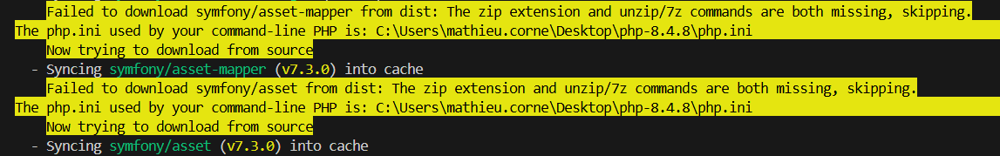
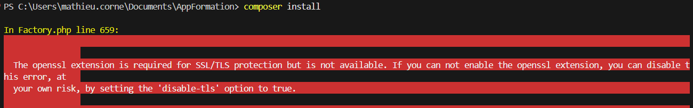

# AppFormation

## Informations sur le projet

- nom : AppFormation - Mairie de Villefontaine
- description : Application interne de réservation de sessions de formations

## Prérequis
- VS Code
- PHP
- Composer
- Node
- npm (Node Package Manager)
- XAMPP

--- 

## Initialiser le projet

### Mise en place de l'environnement

#### Outils de développement

> **PHP**
> [Télécharger PHP via le site officiel PHP](https://windows.php.net/download/).
> 
> **PHP doit être ajouté aux variables d'environement.**

> **Composer** 
> [Télécharger Composer via le site officiel Composer](https://getcomposer.org/download/)

> **Symfony**
> [Télécharger Symfony via le site officiel Symfony](https://symfony.com/doc/current/setup.html)

> **XAMPP**
> [Télécharger XAMPP via Sourceforge](https://sourceforge.net/projects/xampp/)

#### Installation des dépendances

>- **ORM Symfony**
>Un ORM (Object Relational Mapper) permet de transposer une architecture orienté objet à une base de données relationnelle comme MySQL ou PostgreSQL, ce qui facilite la maintenance d'une application.
>
>Pour installer l'ORM Symfony :
>`composer require symfony/orm-pack`

> - **Symfony Maker**
> Le bundle Symfony Maker permet de générer des entités ainsi que leurs controlleurs en nous évitant de devoir nous-même écrire le code en utilisant des commandes qui nous guident étape par étape pour le faire.
> 
> Pour installer Symfony Maker :
> `composer require --dev symfony/maker-bundle`

#### Utilisation du Symfony Maker pour modifier l'architecture de la base de données
Symfony suit une architecture **MVC (Model, View, Controller)**, dans la logique d'une **programmation orientée objet (POO)**. Le bundle **Symfony Maker** permet ainsi de créer de manière guidée pour nous les **entités (ou modèles)** ainsi que les **controlleurs**, uniquement via des commandes sans avoir à écrire du code.

**Le bundle Symfony Maker doit être installé au préalable.**

##### Créer une entité
Une entité ou le modèle représente le concept de la donnée à manipuler (Un utilisateur, une formation, une session).
Afin de créer une entité, il faut utiliser la commande :
**php bin/console make:entity**

[DOC - Créer une entité](https://symfony.com/doc/current/the-fast-track/en/8-doctrine.html#creating-entity-classes)

##### Créer un controlleur
Un controlleur représente la classe chargée de manipuler la donnée en elle même pour les opérations de création, lecture, modification et suppression (CRUD).
**php bin/console make:entity**

[DOC - Créer un controller](https://symfony.com/doc/current/controller.html#a-basic-controller)

##### Gérer les rôles

[DOC - Gérer les rôles](https://nouvelle-techno.fr/articles/live-coding-gerer-les-roles-utilisateur-avec-symfony-4#:~:text=Nous%20attribuons%20les%20r%C3%B4les)

### API

#### Outlook et Teams
[DOC - Créer un événement Outlook](https://learn.microsoft.com/fr-fr/graph/api/calendar-post-events?view=graph-rest-1.0&tabs=http#response)

[DOC - Créer une réunion](https://learn.microsoft.com/en-us/graph/api/application-post-onlinemeetings?view=graph-rest-1.0&tabs=http)


[DOC - Créer et envoyer un mail](https://learn.microsoft.com/fr-fr/graph/api/user-sendmail?view=graph-rest-1.0&tabs=http)

### FullCalendar

[DOC - Calendrier WebComponent](https://fullcalendar.io/docs/web-component)
[DOC - Calendrier à la semaine](https://fullcalendar.io/docs/business-hours)

---

## Modèle Logique de Données

- `utilisateur` (<u>**id**</u>, prenom, nom, email, password, type, **#id_service**)
- `service` (<u>**id**</u>, nom, email)
- `participation` (<u>**#id_utilisateur, #id_session**</u>, date_inscription, type_inscription)
- `session` (<u>**id**</u>, titre, heure_debut, heure_fin, nb_participants_max, statut_session, **#id_formation**, **#id_salle**)
- `salle` (<u>**id**</u>, nom, batiment, nb_places_max)
- `formation` (<u>**id**</u>, titre, description, imageURL, estVisible)
- `competence` (<u>**id**</u>, nom)
- `utilisateur_competence` (<u>**#id_utilisateur**, **#id_competences**</u>)
- `formation_competence` (<u>**#id_formation, #id_competence**</u>)
- `session_service` (<u>**#id_service, #id_session**</u>)


---

## Résoudre les erreurs

### Erreurs de dépendances (DEP)

#### DEP1

A l'installation du bundle Symfony Maker avec l'aide la commande "composer require --dev symfony/maker-bundle", l'erreur **DEP1** peut survenir, empêchant l'installation de certains éléments.



#### DEP2

Au moment de créer la base de données via Doctrine (php bin/console doctrine:database:create), l'erreur DEP2 peut survenir, empêchant la création par Doctrine de cette même base de données.

Cette erreur est liée à une mauvaise configuration du fichier php.ini, plus précisément le PHP principal renseigné dans le PATH. 

**Pour résoudre l'erreur DEP2**, il faut décommenter les lignes `;extension=pdo_mysql` et `;extension=mysqli` en enlevant `;`.


#### DEP3

Au moment de l'installation des dépendances Symfony ou d'autres dépendances PHP, en utilisant Composer, l'erreur DEP3 peut survenir, notamment via les commandes suivantes :
```
composer install
composer require x/x (ex: symfony/orm-pack)
```

.

Cette erreur est liée à une mauvaise configuration du fichier php.ini, plus précisément le PHP principal renseigné dans le PATH.

**Pour résoudre l'erreur DEP3**, il faut décommenter la ligne `;extension=openssl` en enlevant le `;`.

#### DEP4

Au moment de la migration via Doctrine via la commande **php bin/console doctrine:migration:migrate**, l'erreur DEP4 peut survenir, en raison de la non création au préalable de la base de données renseignée dans le **fichier .env**. 

![An exception occured in the driver: SQLSTATE[YY000] [1049] Unknow database 'app'](./doc_AppFormation/erreur_DEP/erreur_DEP4.png)

> **Exemple de fichier .env**
> 
> ```DATABASE_URL="mysql://root@127.0.0.1:3306/app?serverVersion=10.5.8-MariaDB"```
> 
> La base de donnée renseignée est celle renseignée entre / et le ?, ici **app**. 

**Pour résoudre l'erreur DEP4**, il faut créer au préalable la base de données, ce qui peut se faire également via Doctrine avec la commande :
```php bin/console doctrine:database:create```

### Erreurs concernant les outils de développement (TOOL)

Lors du lancement de phpMyAdmin via XAMPP (localhost), l'erreur TOOL1 peut survenir. 

Contrairement à ce qui est indiqué dans l'erreur, cela n'est pas lié à un problème d'extension, et il est possible que MySQL fonctionne correctement (ainsi que phpMyAdmin) et soit décommenté dans le php.ini, sans que l'erreur disparaisse. 

.

Bien que la raison n'a pas été trouvée, il existe un moyen pour contourner cette erreur et accéder à phpMyAdmin.

**Pour contourner l'erreur TOOL1 :**
1. Se rendre dans le dossier où phpMyAdmin est installé, généralement `C:/xampp/phpmyadmin`.

2. Ouvrir un invite de commande dans le dossier (clic droit > "Ouvrir dans le terminal")

3. Lancer un serveur PHP via la commande `php -S localhost:5000`. Le serveur se lancera sur le port 5000.

4. Ouvrir un navigateur et entrez le chemin `localhost:5000`.

## Sécurité 

### Système de hashage 

Le système par défaut de hashage est bcrypt. Les mots de passes sont chiffrés en base de donnée grâce au hash. 

Si le hash correspond alors la connexion est autorisée.

Il est possible d' augmenter le "coût" (cost) du hashage ce qui aura pour résusltat d'améliorer la protection du mot de passe en utilisant plus d'énergie en échange. 