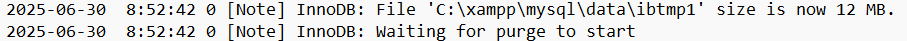
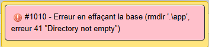

# Résoudre les erreurs

- [Documentation Technique](../README.md)

## Erreurs de dépendances (DEP)

### DEP1

A l'installation du bundle Symfony Maker avec l'aide la commande "composer require --dev symfony/maker-bundle", l'erreur **DEP1** peut survenir, empêchant l'installation de certains éléments.


### DEP2

Au moment de créer la base de données via Doctrine (php bin/console doctrine:database:create), l'erreur DEP2 peut survenir, empêchant la création par Doctrine de cette même base de données.

Cette erreur est liée à une mauvaise configuration du fichier php.ini, plus précisément le PHP principal renseigné dans le PATH. 

**Pour résoudre l'erreur DEP2**, il faut décommenter les lignes `;extension=pdo_mysql` et `;extension=mysqli` en enlevant `;`.


### DEP3

Au moment de l'installation des dépendances Symfony ou d'autres dépendances PHP, en utilisant Composer, l'erreur DEP3 peut survenir, notamment via les commandes suivantes :
```
composer install
composer require x/x (ex: symfony/orm-pack)
```

.

Cette erreur est liée à une mauvaise configuration du fichier php.ini, plus précisément le PHP principal renseigné dans le PATH.

**Pour résoudre l'erreur DEP3**, il faut décommenter la ligne `;extension=openssl` en enlevant le `;`.

### DEP4

Au moment de la migration via Doctrine via la commande **php bin/console doctrine:migration:migrate**, l'erreur DEP4 peut survenir, en raison de la non création au préalable de la base de données renseignée dans le **fichier .env**. 

![An exception occured in the driver: SQLSTATE[YY000] [1049] Unknow database 'app'](./DEP/erreur_DEP4.png)

> **Exemple de fichier .env**
> 
> ```DATABASE_URL="mysql://root@127.0.0.1:3306/app?serverVersion=10.5.8-MariaDB"```
> 
> La base de donnée renseignée est celle renseignée entre / et le ?, ici **app**. 

**Pour résoudre l'erreur DEP4**, il faut créer au préalable la base de données, ce qui peut se faire également via Doctrine avec la commande :
```php bin/console doctrine:database:create```

### DEP5

Au moment du chargement d'une page dans le navigateur, l'erreur DEP5 peut survenir, en raison du non-démarrage du serveur MySQL dans XAMPP (souvent par inadvertance).

**Erreur DEP5 dans phpMyAdmin**


**Erreur DEP5 dans Symfony**
![Symfony - An exception occured in the driver: SQLSTATE[HY000][2002] Aucune connexion n'a pu être établie car l'ordinateur cible l'a expressément refusée](./DEP/erreur_DEP5_Symfony.png)

**Pour résoudre l'erreur DEP5**, il faut appuyer sur le bouton `Start` en face de MySQL dans le Control Panel de XAMPP.

### DEP6

Au moment de la création ou de la modification d'un élément d'une entité dans EasyAdmin, l'erreur DEP6 peut survenir en raison d'une erreur de configuration du fichier php.ini.

Cette erreur est liée à une mauvaise configuration du fichier php.ini.


**Pour résoudre l'erreur DEP6**, il faut décommenter la ligne `;extension=fileinfo`.

## Erreurs concernant les outils de développement (TOOL)

Lors du lancement de phpMyAdmin via XAMPP (localhost), l'erreur TOOL1 peut survenir. 

Contrairement à ce qui est indiqué dans l'erreur, cela n'est pas lié à un problème d'extension, et il est possible que MySQL fonctionne correctement (ainsi que phpMyAdmin) et soit décommenté dans le php.ini, sans que l'erreur disparaisse. 

.

Bien que la raison n'a pas été trouvée, il existe un moyen pour contourner cette erreur et accéder à phpMyAdmin.

**Pour contourner l'erreur TOOL1 :**
1. Se rendre dans le dossier où phpMyAdmin est installé, généralement `C:/xampp/phpmyadmin`.

2. Ouvrir un invite de commande dans le dossier (clic droit > "Ouvrir dans le terminal")

3. Lancer un serveur PHP via la commande `php -S localhost:5000`. Le serveur se lancera sur le port 5000.

4. Ouvrir un navigateur et entrez le chemin `localhost:5000`.

### TOOL2

Au moment de lancer le serveur MySQL dans XAMPP, l'erreur TOOL2 peut survenir et empêcher le démarrage complet de MySQL, en raison de fichiers corrompus dans le dossier `C:\xampp\mysql\data`.

.

**Pour résoudre l'erreur TOOL2**, il faut copier les fichiers du dossier `C:\xampp\mysql\backup` en remplaçant l'ensemble de ceux du dossier `C:\xampp\mysql\data`.

[Résoudre l'erreur TOOL2](https://stackoverflow.com/questions/56767200/cant-run-xampp-mysql)

### TOOL3

Au moment de l'utilisation du dossier de backup pour résoudre l'erreur TOOL2, l'erreur TOOL3 peut survenir lorsque l'on essaye de supprimer la base de données afin de la refaire de zéro, en raison de la corruption du dossier de données correspondant à cette même BDD.

.

**Attention, la base de données corrompue nécessitant d'être supprimée, il est nécessaire d'exporter les données des tables au préalable, sans quoi toutes les informations présentes seront perdues.**

**Pour résoudre l'erreur TOO3**, il faut supprimer la base de données corrompue. Cependant, phpMyAdmin n'arrive pas forcément à supprimer totalement la base de données, même si d'apparence il n'y a plus aucune table. il faut donc supprimer le dossier de la base de données corrompue directement dans `C:\xampp\mysql\data\`, le dossier à supprimer étant celui du même nom que la base de données dans phpMyAdmin. 

Une fois la base de données supprimée, il faut utiliser les commandes pour créer de nouveau l'architecture de la base de données
- `php bin/console doctrine:database:create` - Créer la base de données renseigné dans le fichier .env comme étant celui de l'application
- `php bin/console make:migration` - (OPTIONNEL si fichier de migration déjà existant) Créer un fichier de migration, qui permet à l'ORM de transposer le schéma d'architecture orienté objet en tables relationnelles
- `php bin/console doctrine:migration:migrate` - Exécuter la migration pour mettre à jour l'architecture de la base de données.


[Résoudre l'erreur TOOL3](https://stackoverflow.com/questions/17947255/error-in-dropping-a-database-in-mysql-cant-rmdir-oro-errno-41)

### TOOL4

Au moment de l'édition d'une ligne dans une page CRUD EasyAdmin d'une entité, et si la méthode configureFields dans le controlleur associé à été utilisé avec un CollectionField avec comme objectif de gérer directement les relations, l'erreur TOOL4 peut survenir.


**Pour résoudre l'erreur TOOL4**, il faut créer justement cette méthode __toString() dans l'entité correspondant à l'attribut de relation sous forme de Collection qui utilise le CollectionField, celle indiquée dans l'erreur, ce qui permettra à EasyAdmin d'afficher les valeurs en question pour représenter l'entité dans les pages CRUD.

### TOOL5

Au moment du lancement de MySQL dans XAMPP, l'erreur TOOL5 peut survenir en raison de fichiers de logs corrompus.


**Pour résoudre l'erreur TOOL5**, il faut commencer par supprimer les fichiers de logs corrompus, identifiés par le format aria_log_*.


Ensuite, il faut vérifier les tables ARIA de la BDD pour résoudre les potentielles erreurs.

```
C:\xampp\mysql\bin>aria_chk -r C:\xampp\mysql\data\mysql\*.MAI
C:\xampp\mysql\bin>aria_chk -r -o C:\xampp\mysql\data\mysql\*.MAI
```

Enfin, il devrait être possible de relancer le serveur Apache et MySQL dans XAMPP.

[Résoudre l'erreur TOOL5](https://www.youtube.com/watch?v=FvTYkET3Pfc)