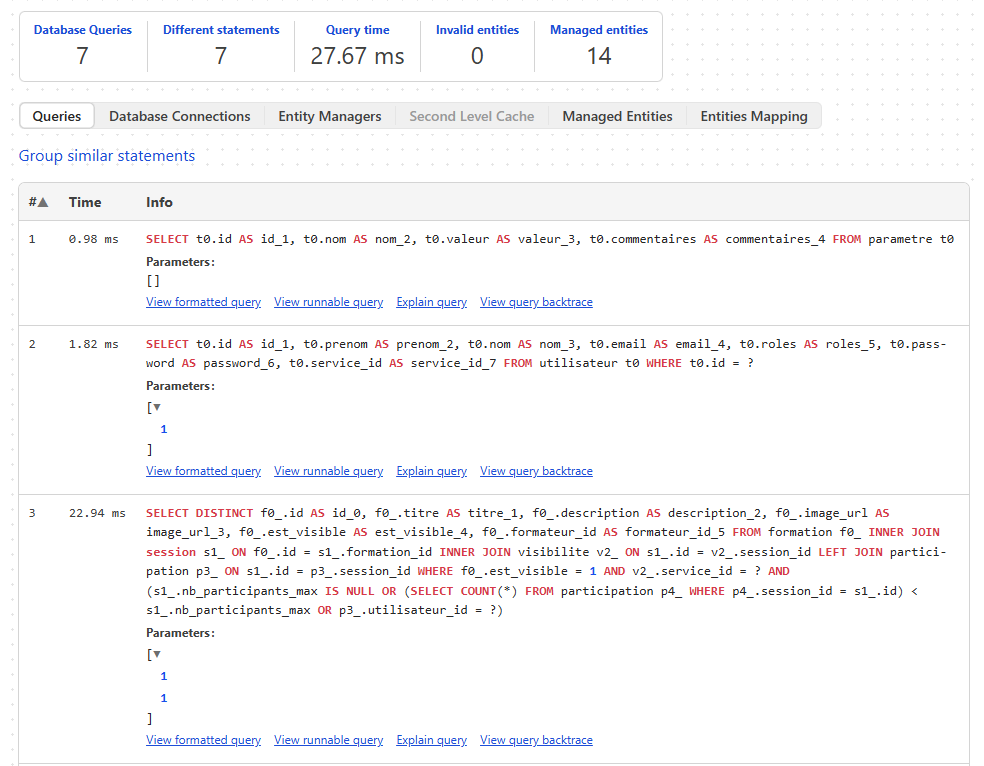
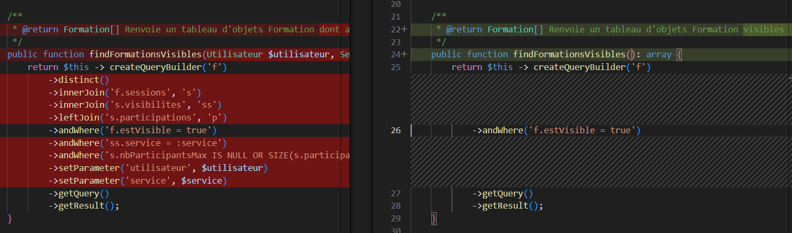
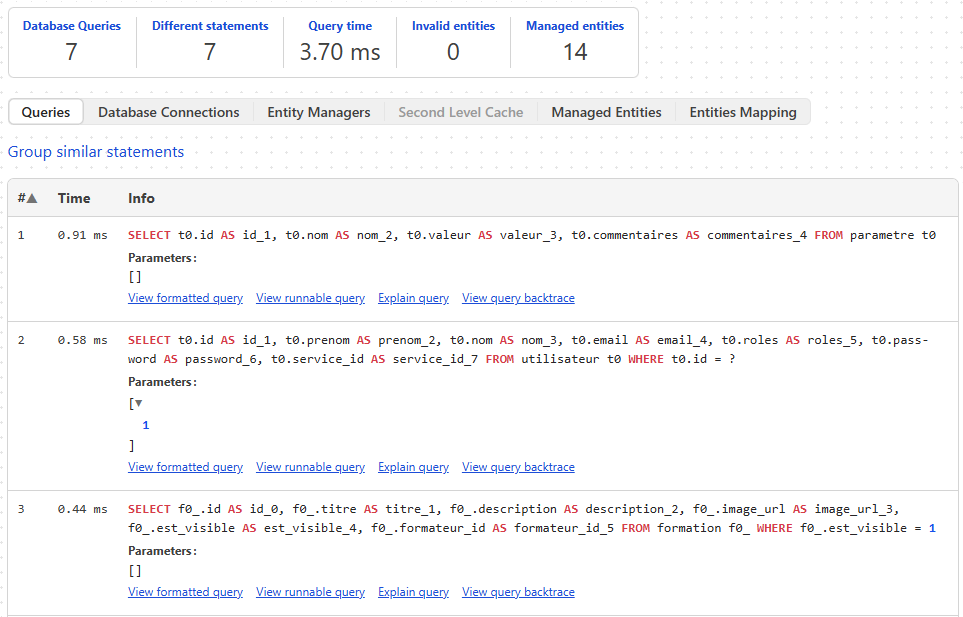

#⚡ Optimisations d'une requête - Chargement des formations

## Contexte

La requête affichait les formations dans la page d'accueil. A l'origine, l'objectif était de vérifier si pour une formation donnée, elle étant dans un premier temps visible, et dans un deuxième temps que cette même formation possédait au moins une session [qui est visible pour le service de l'utilisateur] et/ou auquel l'utilisateur est déjà inscrit.

## 🐌 Problème identifié

Cependant, la logique a été amélioré et ce deuxième temps qui impliquait des jointures et sous-requêtes avec les tables sessions, participations et visibilites devenaient redondant par rapport à ce qui était fait par des méthodes des entités.

De plus, le distinct est inutile puisque les formations sont toutes différentes de fait.

### Symptômes

Le temps de réponse de cette requête était compris entre 20+ms à 40ms pour un temps global des requêtes entre +30ms à +50ms, ralentissant considérablement la page.

Pour se charger, la page d'accueil mettait ainsi entre 500ms à 1000ms.

### Exemple de code problématique

## ✅ Correction

## 📈 Performances après optimisation

- Passage de ~30ms à ~3ms de temps global **(temps global/10)**
- Passage de ~22ms à 0.44ms de temps d'exécution de la requête **(temps requête/57)**

